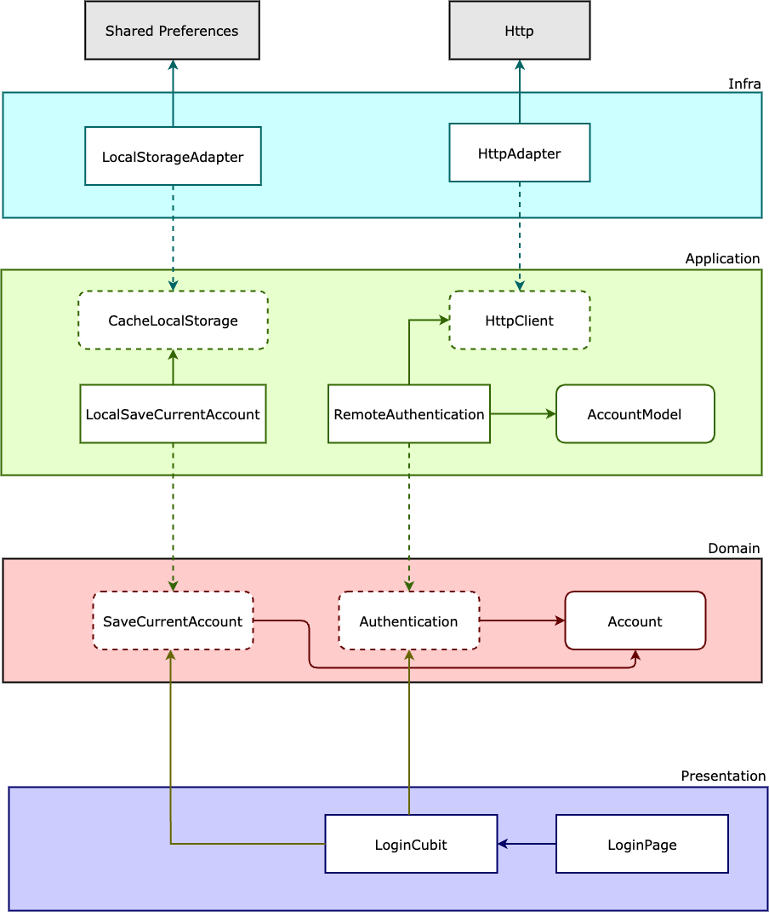

# Flutter Cubit Microblog 

 

This application was developed using a well-defined and decoupled architecture, following TDD (test-driven programming) as a working methodology, Clean Architecture to make the distribution of responsibilities in layers, always following the SOLID principles and applying Design Patterns to solve some common problems.

## Architecture

This project is organized into four distinct layers: Presentation, Domain, Application, and Infra. Each layer serves a specific purpose and contributes to the overall functionality of the system.

### Presentation

The Presentation layer is responsible for handling user interactions and displaying information to the user. It includes components such as user interfaces, views, controllers, or any other elements that directly interact with the user.

### Domain

The Domain layer encapsulates the core business logic and rules of the application. It contains entities, models, and services that represent and manage the business objects and their interactions. This layer is independent of any specific infrastructure or user interface.

### Application

The Application layer acts as an intermediary between the Presentation and Domain layers. It coordinates the workflow, processes user requests from the Presentation layer, and delegates actions to the Domain layer. It contains use cases, application services, or interactors that orchestrate the application's functionality.

### Infra

The Infra layer is responsible for handling external concerns such as databases, network communications, third-party integrations, and other infrastructure-related tasks. It includes repositories, data access objects, external API clients, and any implementation-specific code.

|                       |
| :-------------------- |
|  |
|                       |

## Roadmap

| Testing      | Progress |
| :--------- | :-------: |
| Unit       |    ✅     |
| Widgets    |    ✅     |
| Integration |   ☑️      |

## Libraries and Tools

- bloc 
- bloc_test 
- cupertino_icons 
- equatable 
- flutter_bloc 
- formz 
- http 
- intl
- shared_preferences 
- provider
- faker 
- mockito
## Testing

- Unit tests
- Cubit/Stream tests
- Widget Tests
- Navigation tests
- Form Validation tests
- Test Doubles
- Mocks
- Stubs
- Spies